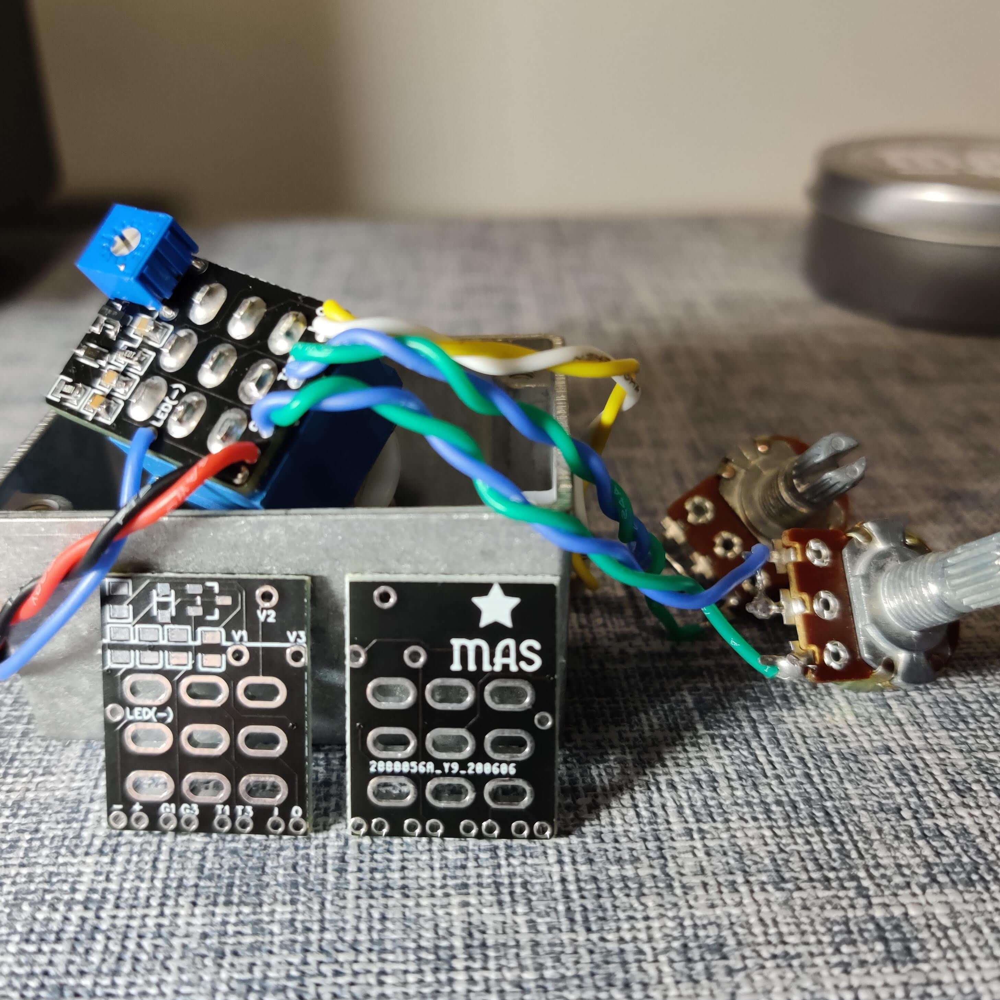
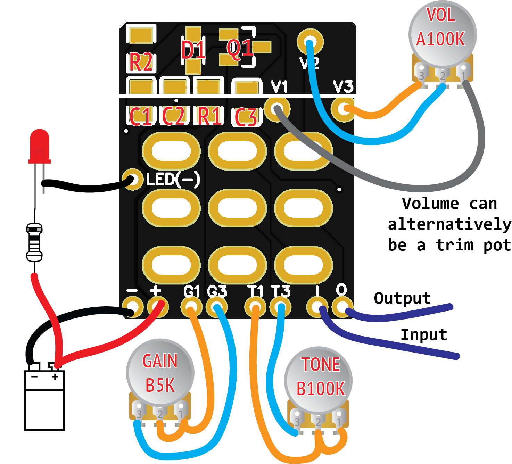
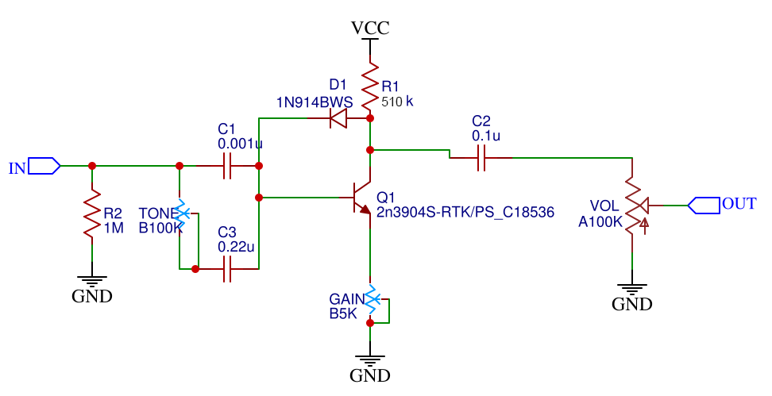
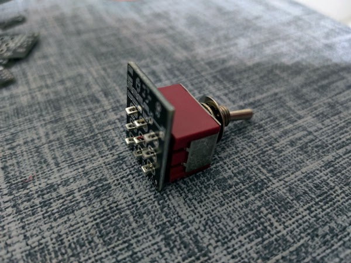

# StompFuzz

---

*For more DIY pedal fun (e.g. an [even ridiculously tinier version](https://mas-effects.square.site/product/picofuzz-kit/25?cp=true&sa=false&sbp=false&q=false&category_id=7) of this), visit the [MAS Effects](https://mas-effects.com) page.*

---

This is a fun and practical guitar pedal, and a great opportunity to practice surface mount (SMD) soldering (and do so with nothing but your regular soldering iron). It fits neatly over a 3PDT stomp (or toggle) switch.

### How to get it

You can either download the gerber files from this repo, or [buy the PCB on my store here](https://mas-effects.square.site/product/stompfuzz-pcb/24?cp=true&sa=false&sbp=false&q=false&category_id=7), or get a [kit that includes SMD components and footswitch](https://mas-effects.square.site/product/stompfuzz-kit/26?cp=true&sa=false&sbp=false&q=false&category_id=7).

## Intro

This is a bazz fuss circuit, with endless possibilities to try. 

If you want a tinier, simpler version check out the [picofuzz](https://github.com/mstratman/picofuzz).

I recommend experimenting with component values. e.g. see these writeups for some ideas to get started

* [tonefiend project](https://www.tonefiend.com/wp-content/uploads/DIY-Club-Project-2-v02.pdf)
* [home-wrecker.com writeup](http://home-wrecker.com/bazz.html)

## Pics and Wiring Diagram

## Assembly Tips 

You can solder SMD components with a regular soldering iron, and no special tools or equipment. It doesn't take a lot of practice, and this board is great for it.

Here are some tips:

* **Order of components**: First solder the SMD components, then the trim pot (if using one), then the wires, then the stomp or toggle switch
* **Soldering steps**
  * Pre-tin one pad on the PCB
  * In your non-dominant hand: Place and hold the component with tweezers
  * With your dominant hand: Heat the component and the pad simultaneously with the soldering iron. Solder should flow up onto the component.
  * You no longer need the tweezers.
  * Go to the other side of the component and apply heat to the component and pad, then touch a tiny amount of solder to it.
  * Optionally, if necessary, go back to the first pad and add a bit more solder.
* **Soldering iron tip size and shape**: It may seem intuitive to use a tiny tip on your iron, but this will probably make the job more difficult since it will be harder to apply even heat to both the component and pad. Instead, use a regular conical pencil-type of tip.

## Schematic

NOTE: Resistors and capacitors are 0805 packages.

You can and should substitute other values for all the components. But these are decent starting points.

## Omitting potentiometers

All of the pots on this pedal are optional. Here are steps to omit any or all of the 3:

**Omit Volume**: Jumper V2 to V3

**Omit Tone**: Omit C3, solder nothing to T1 and T3

**Omit Gain**: Jumper G1 to G3

## Combinations to try:

TODO: This should be filled in and fleshed out further

* MMBTA14LT1G + 100k
* MMBT6427LT1G  + ?
* MMBT3904VL  + 510k
* MMBT5088LT1G + 100k

Diodes:
1N914BWS
BAT46JFILM

* C1: 0.001uF
* C2: 0.1uF
* C3: 0.22uF
* R1: 510k 
* D1: 1N914BWS
* Q1: MMBT3904VL

## Tone

Tone control blends between C1 and C3. Pick two different values to change which frequencies get cut when the tone is high or low.

## Buzz Box

Try chaining it with a [picofuzz](https://github.com/mstratman/picofuzz) to allow you to switch between a single and dual fuzz.

## Guitar-mounted

Instead of a stomp switch, simply use a 3PDT toggle instead and you can mount
it in your guitar.

## Optional add-ons:

* diode for polarity protection
* filter power supply for noise. e.g. 22uF cap between +9V and GND
* LED: and optionally anti-pop on LED

Note this already has a 1M resistor on the input cap to help limit switch popping
